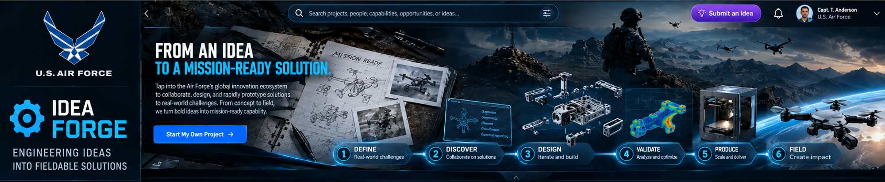

# Idea Forge

Turning bold ideas into mission-ready capabilities. One Databricks app: AppKit is the runtime, the Unified Mission Workbench (UMW) provides the underlying capabilities, and the concept graphic is the UI contract. The Lakebase schema stays `foundry` so existing review-trail tables do not move. GitHub redirects the old `cl-idea-foundry` URL to this repository.



## What is in this first slice

- **Shell** from the concept: Air Force lockup and Idea Forge mark in the sidebar, search, Submit an idea, notifications and the signed-in user in the top bar.
- **Hero** with the headline, Start My Own Project, and the six-stage pipeline: Define, Discover, Design, Validate, Produce, Field.
- **Collapse tab.** The tab under the hero folds it vertically into a single band that keeps the headline, the call to action and the pipeline. The choice is remembered per browser. Below 1720 px wide the band shows the pipeline only.
- **Home board**: projects in flight with their stage, open challenges, and the capability network. Search filters all three.
- **Stage pages** for each of the six stages. Design and Validate open UMW's CAD workspace; the other four list the projects at that stage and are marked as concept.
- **Submit an idea / Start My Own Project** add a project at Define.

Data is the design mock (`client/src/lib/data.ts`). When a slice moves to the warehouse, its query goes in `config/queries/`.

## Capabilities from UMW

Copied from `DocBranton/umw` at `8bf07e0`, not imported. Changes are limited to renaming.

| Capability | Where | Notes |
| --- | --- | --- |
| AppKit runtime, build and bundle config | `package.json`, `tsconfig*.json`, `tsdown.server.config.ts`, `client/vite.config.ts`, `app.yaml`, `databricks.yml` | App name `idea-forge`, same workspace as UMW |
| Verified Engineering CAD | `client/src/cad/`, `client/public/cad/`, `client/public/vendor/occt/` | STEP, IGES, BREP, STL, OBJ, glTF in the browser. Feature recognition, drawing generation. OpenCascade is LGPL-2.1, unmodified |
| CAD review trail | `server/cad-events.ts`, `server/cad-routes.ts` | Lakebase table renamed to `foundry.cad_events`. Off until a `postgres` resource is configured (see UMW's README › Review trail; the steps are the same) |
| Signed-in user | `server/me-route.ts` | `GET /api/me` from the Databricks Apps headers. The top bar shows the concept persona until a real user is signed in |

The stage pages use the CAD workspace in its stand-alone mode, so reviews are kept in the browser. Wiring it to the shared review trail, as UMW's Engineering view does, is the next step for Validate.

## Run

Requires the Databricks CLI, authenticated to the workspace in `databricks.yml`.

```bash
npm install
npm run dev
```

```bash
npm run typecheck
npm run build
npm run test:cad
```

## Deploy

`databricks bundle deploy` from this directory, or run the **Deploy Idea Forge to Databricks** workflow. The workflow is manual until the `DATABRICKS_TOKEN` secret is added to this repository; then add a `push` trigger on `main`.

## Hero art

`client/public/brand/hero-art.jpg` is cropped from the concept image and upscaled. Replace it with the full-resolution art at the same aspect (about 4.8:1); the stylesheet anchors it to the right and fades it into the headline on the left.
