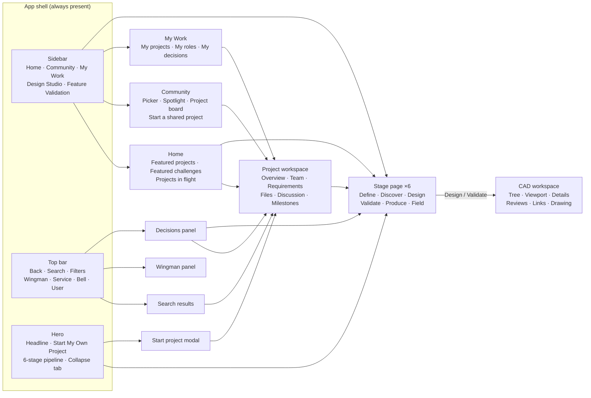
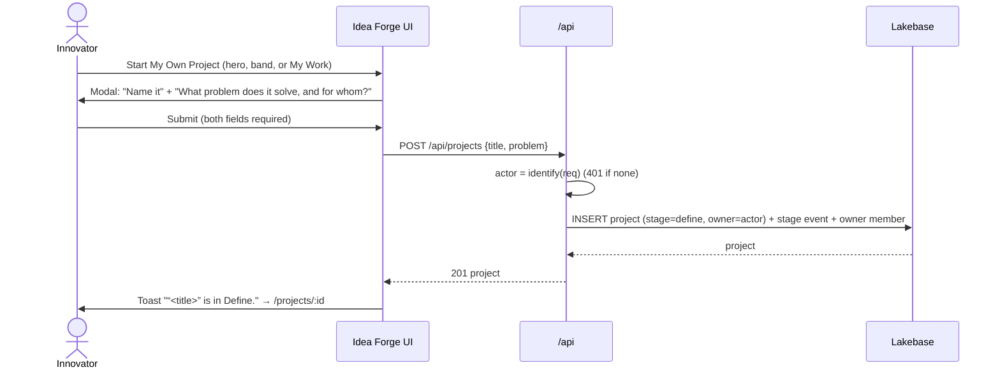
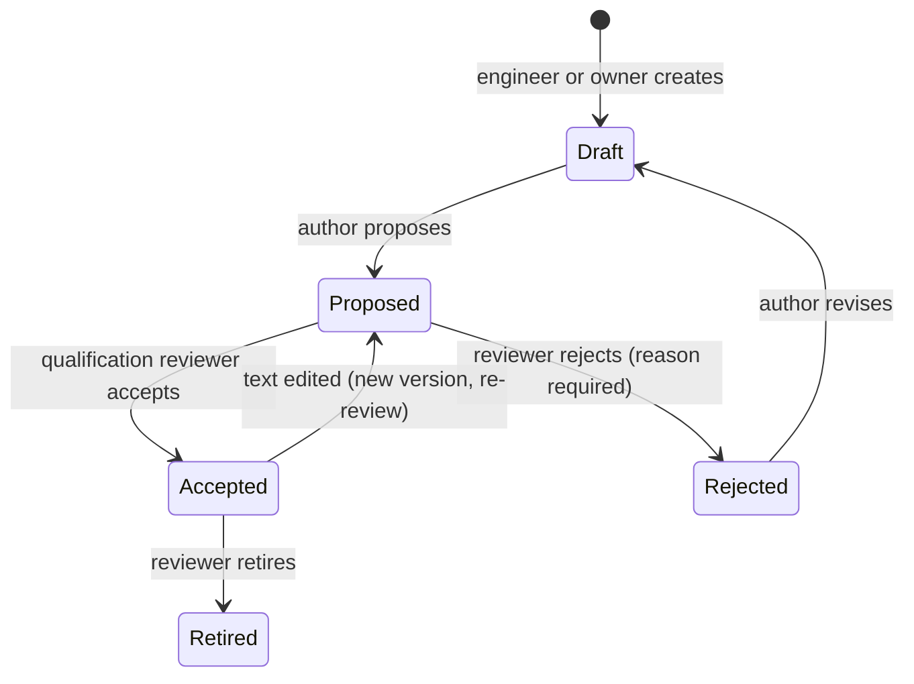
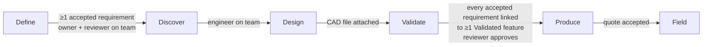
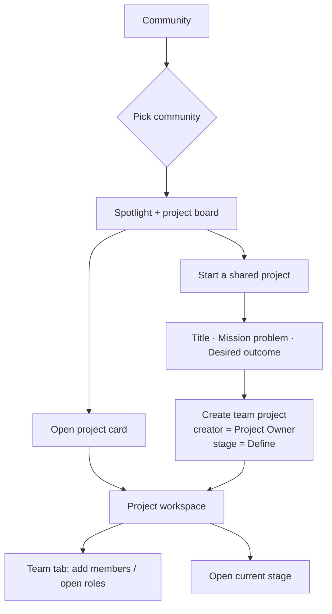

# Idea Forge — App Flow

| | |
| --- | --- |
| Status | Draft v0.1 |
| Date | 9 Oct 2026 |
| Related | [PRD](01-product-requirements.md) · [Design brief](04-design-brief.md) · [TRD](02-technical-requirements.md) |

This document describes how people move through Idea Forge: the screen map, the routes, the main journeys, and who can do what. Diagrams use Mermaid and render on GitHub.

## 1. Screen map



## 2. Shell behavior

| Element | Behavior |
| --- | --- |
| Sidebar | Workspace: Home, Community, My Work. Tools: Design Studio (→ Design), Feature Validation (→ Validate). Collapse to an icon rail (remembered per browser). On ≤ 900 px it becomes an off-canvas drawer opened by the menu button, closed by the scrim. |
| Back | Returns to the previous view. Today a client-side history stack; with routing it is the browser back button. Disabled when there is no history. |
| Search | Typing filters the current list surfaces; from a stage page it returns to Home results. Target: dedicated results view grouped by Projects, People, Capabilities, Challenges. |
| Filters | Target: stage, community, service, unit, owner. Today shows "Filters arrive with live data." |
| Service switch | Air Force / Army / Navy. Changes the assistant label (Ask your Wingman / Ask an AI assistant / Plan a mission) and, when not signed in, the concept persona. |
| Decisions bell | Lists items needing the user; each has one action button that deep-links (e.g. Accept → Validate stage of that project). |
| Hero | Expanded: headline, copy, Start My Own Project, pipeline. Collapsed: one band with headline, smaller CTA and pipeline; below 1720 px the band shows the pipeline only. Current stage is highlighted in the pipeline. |
| Toast | Single line, bottom, auto-dismiss 2.4 s, `role="status"`. |

## 3. Routes

Today navigation is an in-memory `View` union (`home | community | work | stage`). Target routes (Phase 1):

| Route | View | Notes |
| --- | --- | --- |
| `/` | Home | |
| `/community` | Community list (default community) | |
| `/community/:communityId` | Community board | |
| `/work` | My Work | |
| `/stage/:stageId` | Stage page | `define · discover · design · validate · produce · field` |
| `/projects/:projectId` | Project workspace, Overview tab | |
| `/projects/:projectId/:tab` | Tab | `team · requirements · files · discussion · milestones` |
| `/projects/:projectId/stage/:stageId` | Stage page scoped to the project | Design/Validate open CAD with the project's files and requirements |
| `/challenges` · `/challenges/:id` | Challenges | |
| `/capabilities` | Capability directory | |
| `/search?q=` | Search results | |

Modals (start project, invite, request quote) are overlays and do not change the route.

## 4. Core journeys

### 4.1 Start a project (Define)



Rules: title ≤ 120 chars, problem ≤ 4,000. Escape or scrim click cancels. Focus lands on the first field and returns to the trigger on close.

### 4.2 Build the team (Define → Discover)

1. Owner opens **Team** tab. Default open roles: Engineer, Maintainer, Qualification Reviewer (shown as "Open role — community help wanted").
2. **Add team member** → pick a person from the directory, role, organization (prefilled from directory).
3. Invitee gets a notification → **Accept** or **Decline**. Accepted members fill the open role of the same name, otherwise are appended.
4. Owner cannot be removed; other members can be removed by the owner (event recorded).
5. Community members can **Volunteer** for an open role; owner approves.

### 4.3 Requirements (Define)



Every transition appends a `requirement_events` row with actor and reason. The "Requirements ready to accept" decision appears in the reviewer's bell when any requirement is Proposed.

### 4.4 Stage advancement



- The owner moves a project forward; entry criteria above are checked server-side and shown as a checklist on the stage page. Unmet criteria disable the button and say what is missing.
- Moving back is always allowed with a reason.
- The Validate → Produce move additionally requires the Qualification Reviewer's approval (a decision item).
- Every move appends `project_stage_events {from, to, actor, reason}`.

### 4.5 Design and Validate (CAD)

```mermaid
sequenceDiagram
  actor E as Engineer
  participant UI as CAD workspace
  participant API as /api/cad
  participant DB as foundry.cad_events

  E->>UI: Open project file (or upload STEP/IGES/BREP/STL/OBJ/glTF)
  UI->>UI: Parse in worker (OCCT WASM), tessellate, analyze features
  UI->>API: GET /api/cad/events?project=&model=
  API->>DB: SELECT … ORDER BY id
  API-->>UI: events → replay → reviews + links
  E->>UI: Select Hole001 → Validate, link REQ-002
  UI->>API: POST /api/cad/events {project, model, action}
  API->>DB: advisory lock → INSERT if changed → SELECT all
  API-->>UI: {changed, events}
  UI->>E: Status chip updates; trail shows "Validated by alice@… 14:02"
```

Failure: if the trail cannot be reached the UI keeps the previous state and toasts "The review trail could not be reached. Nothing was changed." Without Lakebase the workspace runs stand-alone with "Saved in this browser only".

Design stage emphasizes viewer, measure, section and drawing generation. Validate emphasizes the feature list with status filters, requirement linking and the traceability matrix.

### 4.6 Produce

1. Stage page lists capabilities filtered by the part's process/material.
2. **Request quote** → choose capability, quantity, need-by date → provider notified.
3. Provider responds Accept (lead time, cost) / Decline / Counter.
4. Owner accepts one quote → project can move to Field.
5. Capacity alerts (e.g. pool over 100%) appear in the bell of affected owners.

### 4.7 Field

1. Owner records fielding: receiving unit(s), quantity, date.
2. Owner (or receiving maintainer) records impact against the Define measures.
3. Project becomes eligible for Featured projects; community lead can feature it.

### 4.8 Community-sponsored project



### 4.9 Decisions bell

| Notice | Who sees it | Action | Goes to |
| --- | --- | --- | --- |
| Requirements ready to accept | Project's Qualification Reviewer | Accept | Project › Requirements |
| Advance to Produce awaiting approval | Qualification Reviewer | Review | Project › Validate |
| Invite to a project | Invitee | Accept / Decline | Inline |
| Capacity slip (e.g. NDT / CT pool at 184%) | Owners of affected projects | Review | Community / Capabilities |
| MICAP escalation | Owner, sponsor | Open | Project › current stage |
| Quote response | Owner | Open | Project › Produce |

### 4.10 Wingman

Open from the top bar. Pick one of five wingmen (Capt. Mira – Operations Officer, Lt. Mason – Engineer, Chief Arden – Mentor, Nova – Technical Analyst, Echo – Readiness). Ask in free text; quick prompts for source of repair trade, qualification gaps, and opening the engineering thread. Today answers are local and scripted; target answers are grounded in the selected project and cite their sources.

## 5. Empty, loading and error states

| Situation | Copy / behavior |
| --- | --- |
| No projects match search | "No projects match “<query>”." |
| Stage has no projects | "No projects are at this stage yet." |
| My Work empty | "Nothing is assigned to <name> yet." + Start my own project |
| Community board empty | "No projects match in this community. Start the first shared project." |
| Workspace tab not yet wired | Placeholder that says it's ready for integration; never fabricated content. |
| CAD loading | "Loading the CAD workspace…" |
| Not signed in, write attempted | 401 copy, e.g. "Sign in to record reviews. Changes are attributed to the signed-in engineer." |
| Server/store unreachable | "<Thing> could not be reached. Nothing was changed." |
| Concept-only stage | "This stage is in the concept. Its working tools land in a later slice." |

## 6. Permissions matrix

✔ allowed · ◐ own items only · — not allowed. "Member" = any team role on the project.

| Action | Any signed-in | Member | Owner | Engineer | Qual. reviewer | Admin |
| --- | --- | --- | --- | --- | --- | --- |
| View projects, communities, challenges | ✔ | ✔ | ✔ | ✔ | ✔ | ✔ |
| Start a project | ✔ | ✔ | ✔ | ✔ | ✔ | ✔ |
| Edit Define fields | — | — | ✔ | — | — | ✔ |
| Invite / remove members | — | — | ✔ | — | — | ✔ |
| Volunteer for open role | ✔ | — | — | — | — | — |
| Create / edit requirement | — | — | ✔ | ✔ | — | ✔ |
| Accept / reject / retire requirement | — | — | — | — | ✔ | ✔ |
| Upload project files | — | ✔ | ✔ | ✔ | ✔ | ✔ |
| CAD review / link actions | — | — | ✔ | ✔ | ✔ | ✔ |
| Move stage forward / back | — | — | ✔ | — | — | ✔ |
| Approve Validate → Produce | — | — | — | — | ✔ | ✔ |
| Post discussion message | ✔ (community-visible) | ✔ | ✔ | ✔ | ✔ | ✔ |
| Edit / hide own message | ◐ | ◐ | ◐ | ◐ | ◐ | ✔ |
| Post challenge | sponsor group | | | | | ✔ |
| Hide content (moderation) | — | — | — | — | — | ✔ |

The server enforces this matrix; the UI only hides or disables controls to match.
