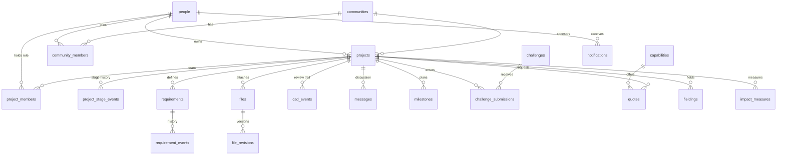

# Idea Forge — Backend Schema

| | |
| --- | --- |
| Status | Draft v0.1 |
| Date | 9 Oct 2026 |
| Store | Lakebase (Postgres 16 compatible), schema **`foundry`** |
| Related | [TRD §4.3](02-technical-requirements.md#43-persistence) · [Implementation plan](06-implementation-plan.md) |

The schema keeps the name `foundry` so the existing review trail (`foundry.cad_events`) does not move. Everything below is additive to what `server/cad-events.ts` already creates.

## 1. Conventions

- **Keys:** `TEXT` ids generated by the server (`prj_…`, `req_…`) using a 16-byte random suffix (`crypto.randomUUID()` without dashes is fine). People use the Databricks user id from `x-forwarded-user`.
- **Time:** `TIMESTAMPTZ NOT NULL DEFAULT now()`.
- **Actors:** every write stores `*_by TEXT REFERENCES foundry.people(id)`; the value always comes from `identify(req)`.
- **Mutable rows** carry `version INT NOT NULL DEFAULT 1` (optimistic concurrency) and `updated_at`.
- **Moderation:** mutable user content has `hidden_at`, `hidden_by` instead of DELETE.
- **Event tables** are append-only: a shared trigger function raises on UPDATE, DELETE and TRUNCATE (same pattern as `cad_events`).
- **Enums** are `TEXT` + `CHECK` (easier to evolve than Postgres enum types, and matches the existing table).
- **Migrations:** numbered files in `server/migrations/`, tracked in `foundry.schema_migrations`.

## 2. Entity-relationship overview



## 3. Tables

### 3.1 Shared infrastructure

```sql
CREATE SCHEMA IF NOT EXISTS foundry;

CREATE TABLE IF NOT EXISTS foundry.schema_migrations (
  version     INT PRIMARY KEY,
  name        TEXT NOT NULL,
  applied_at  TIMESTAMPTZ NOT NULL DEFAULT now()
);

-- One append-only guard for every event table.
CREATE OR REPLACE FUNCTION foundry.append_only() RETURNS trigger LANGUAGE plpgsql AS $$
BEGIN RAISE EXCEPTION '%.% is append-only', TG_TABLE_SCHEMA, TG_TABLE_NAME; END $$;
```

Apply to an event table `T`:

```sql
CREATE TRIGGER T_no_change   BEFORE UPDATE OR DELETE ON foundry.T FOR EACH ROW       EXECUTE FUNCTION foundry.append_only();
CREATE TRIGGER T_no_truncate BEFORE TRUNCATE          ON foundry.T FOR EACH STATEMENT EXECUTE FUNCTION foundry.append_only();
```

### 3.2 People

```sql
CREATE TABLE foundry.people (
  id            TEXT PRIMARY KEY,            -- x-forwarded-user
  email         TEXT,
  display_name  TEXT,                        -- from directory; fallback parsed from email
  rank          TEXT,
  organization  TEXT,                        -- e.g. 'AFLCMC / RSO'
  service       TEXT CHECK (service IN ('airforce', 'army', 'navy', 'civilian', 'other')),
  is_admin      BOOLEAN NOT NULL DEFAULT false,
  first_seen_at TIMESTAMPTZ NOT NULL DEFAULT now(),
  last_seen_at  TIMESTAMPTZ NOT NULL DEFAULT now()
);
CREATE UNIQUE INDEX people_email ON foundry.people (lower(email)) WHERE email IS NOT NULL;
```

### 3.3 Communities

```sql
CREATE TABLE foundry.communities (
  id          TEXT PRIMARY KEY,               -- 'c17', 'additive', …
  name        TEXT NOT NULL,
  kind        TEXT NOT NULL CHECK (kind IN ('platform', 'process', 'service', 'other')),
  summary     TEXT,
  image_path  TEXT,                           -- e.g. '/stages/field.jpg'
  created_by  TEXT REFERENCES foundry.people(id),
  created_at  TIMESTAMPTZ NOT NULL DEFAULT now(),
  archived_at TIMESTAMPTZ
);

CREATE TABLE foundry.community_members (
  community_id TEXT NOT NULL REFERENCES foundry.communities(id),
  person_id    TEXT NOT NULL REFERENCES foundry.people(id),
  role         TEXT NOT NULL DEFAULT 'member' CHECK (role IN ('member', 'lead')),
  joined_at    TIMESTAMPTZ NOT NULL DEFAULT now(),
  PRIMARY KEY (community_id, person_id)
);
```

Seed with the ten communities in `client/src/components/Communities.tsx` (C-17, C-130, Rotary Wing, NAVAIR, Army Aviation, Additive Manufacturing, CNC Machining, Electronics & PCB, Aerospace Ground Equipment, Joint / Other). Member counts are computed, not stored.

### 3.4 Projects

```sql
CREATE TABLE foundry.projects (
  id              TEXT PRIMARY KEY,
  title           TEXT NOT NULL CHECK (length(title) BETWEEN 1 AND 120),
  problem         TEXT NOT NULL CHECK (length(problem) BETWEEN 1 AND 4000),
  outcome         TEXT CHECK (length(outcome) <= 4000),
  affected_users  TEXT CHECK (length(affected_users) <= 1000),
  done_criteria   TEXT CHECK (length(done_criteria) <= 4000),
  stage           TEXT NOT NULL DEFAULT 'define'
                  CHECK (stage IN ('define', 'discover', 'design', 'validate', 'produce', 'field')),
  owner_id        TEXT NOT NULL REFERENCES foundry.people(id),
  unit            TEXT,                        -- owner's unit at creation, editable
  community_id    TEXT REFERENCES foundry.communities(id),
  part_number     TEXT,                        -- shown in CAD drawing title block, e.g. 'IF-0001'
  part_rev        TEXT,
  featured        BOOLEAN NOT NULL DEFAULT false,
  version         INT NOT NULL DEFAULT 1,
  created_at      TIMESTAMPTZ NOT NULL DEFAULT now(),
  updated_at      TIMESTAMPTZ NOT NULL DEFAULT now(),
  hidden_at       TIMESTAMPTZ,
  hidden_by       TEXT REFERENCES foundry.people(id),
  search          TSVECTOR GENERATED ALWAYS AS (
                    setweight(to_tsvector('english', coalesce(title, '')), 'A') ||
                    setweight(to_tsvector('english', coalesce(problem, '') || ' ' || coalesce(outcome, '')), 'B')
                  ) STORED
);
CREATE INDEX projects_stage     ON foundry.projects (stage, updated_at DESC) WHERE hidden_at IS NULL;
CREATE INDEX projects_owner     ON foundry.projects (owner_id, updated_at DESC);
CREATE INDEX projects_community ON foundry.projects (community_id, updated_at DESC);
CREATE INDEX projects_search    ON foundry.projects USING GIN (search);

-- Stage history (append-only). projects.stage is updated in the same transaction.
CREATE TABLE foundry.project_stage_events (
  id          BIGSERIAL PRIMARY KEY,
  project_id  TEXT NOT NULL REFERENCES foundry.projects(id),
  from_stage  TEXT CHECK (from_stage IN ('define', 'discover', 'design', 'validate', 'produce', 'field')),
  to_stage    TEXT NOT NULL CHECK (to_stage IN ('define', 'discover', 'design', 'validate', 'produce', 'field')),
  reason      TEXT CHECK (length(reason) <= 1000),
  actor_id    TEXT NOT NULL REFERENCES foundry.people(id),
  at          TIMESTAMPTZ NOT NULL DEFAULT now(),
  CHECK (from_stage IS DISTINCT FROM to_stage)
);
CREATE INDEX project_stage_events_project ON foundry.project_stage_events (project_id, id);
-- + append-only triggers
```

`from_stage` is NULL only for the creation event. `collaborators` and `updated` shown in the UI are computed (member count, `updated_at`).

### 3.5 Team

```sql
CREATE TABLE foundry.project_members (
  id            TEXT PRIMARY KEY,
  project_id    TEXT NOT NULL REFERENCES foundry.projects(id),
  person_id     TEXT REFERENCES foundry.people(id),     -- NULL = open role
  role          TEXT NOT NULL CHECK (role IN ('owner', 'engineer', 'maintainer', 'qualification_reviewer',
                                              'am_specialist', 'supply_chain', 'other')),
  role_label    TEXT,                                    -- free text when role = 'other'
  organization  TEXT,
  state         TEXT NOT NULL DEFAULT 'active'
                CHECK (state IN ('open', 'invited', 'active', 'declined', 'removed')),
  version       INT NOT NULL DEFAULT 1,
  created_at    TIMESTAMPTZ NOT NULL DEFAULT now(),
  updated_at    TIMESTAMPTZ NOT NULL DEFAULT now(),
  CHECK ((state = 'open') = (person_id IS NULL))
);
CREATE UNIQUE INDEX project_one_owner ON foundry.project_members (project_id) WHERE role = 'owner' AND state = 'active';
CREATE UNIQUE INDEX project_member_once ON foundry.project_members (project_id, person_id, role)
  WHERE person_id IS NOT NULL AND state IN ('invited', 'active');
CREATE INDEX project_members_person ON foundry.project_members (person_id) WHERE state = 'active';

CREATE TABLE foundry.membership_events (
  id          BIGSERIAL PRIMARY KEY,
  project_id  TEXT NOT NULL REFERENCES foundry.projects(id),
  member_id   TEXT NOT NULL REFERENCES foundry.project_members(id),
  kind        TEXT NOT NULL CHECK (kind IN ('opened', 'invited', 'accepted', 'declined', 'volunteered', 'removed')),
  person_id   TEXT REFERENCES foundry.people(id),
  role        TEXT NOT NULL,
  actor_id    TEXT NOT NULL REFERENCES foundry.people(id),
  at          TIMESTAMPTZ NOT NULL DEFAULT now()
);
-- + append-only triggers
```

### 3.6 Requirements

```sql
CREATE TABLE foundry.requirements (
  id          TEXT PRIMARY KEY,
  project_id  TEXT NOT NULL REFERENCES foundry.projects(id),
  ref         TEXT NOT NULL,                  -- human id, 'REQ-002'; what CAD links store
  text        TEXT NOT NULL CHECK (length(text) BETWEEN 1 AND 4000),
  rationale   TEXT CHECK (length(rationale) <= 4000),
  verification TEXT CHECK (verification IN ('inspection', 'analysis', 'demonstration', 'test')),
  status      TEXT NOT NULL DEFAULT 'draft'
              CHECK (status IN ('draft', 'proposed', 'accepted', 'rejected', 'retired')),
  revision    INT NOT NULL DEFAULT 1,         -- bumps when text changes
  version     INT NOT NULL DEFAULT 1,         -- optimistic concurrency
  created_by  TEXT NOT NULL REFERENCES foundry.people(id),
  created_at  TIMESTAMPTZ NOT NULL DEFAULT now(),
  updated_at  TIMESTAMPTZ NOT NULL DEFAULT now(),
  UNIQUE (project_id, ref)
);
CREATE INDEX requirements_project ON foundry.requirements (project_id, status);

CREATE TABLE foundry.requirement_events (
  id              BIGSERIAL PRIMARY KEY,
  requirement_id  TEXT NOT NULL REFERENCES foundry.requirements(id),
  kind            TEXT NOT NULL CHECK (kind IN ('created', 'edited', 'status')),
  from_status     TEXT,
  to_status       TEXT,
  revision        INT NOT NULL,
  text_snapshot   TEXT NOT NULL,              -- the text at this revision, for audit
  reason          TEXT CHECK (length(reason) <= 1000),
  actor_id        TEXT NOT NULL REFERENCES foundry.people(id),
  at              TIMESTAMPTZ NOT NULL DEFAULT now(),
  CHECK ((kind = 'status') = (to_status IS NOT NULL))
);
CREATE INDEX requirement_events_req ON foundry.requirement_events (requirement_id, id);
-- + append-only triggers
```

Refs are allocated per project as `REQ-` + zero-padded sequence (max existing + 1 under the project's advisory lock).

### 3.7 Files

```sql
CREATE TABLE foundry.files (
  id          TEXT PRIMARY KEY,
  project_id  TEXT NOT NULL REFERENCES foundry.projects(id),
  name        TEXT NOT NULL CHECK (length(name) BETWEEN 1 AND 255),
  kind        TEXT NOT NULL CHECK (kind IN ('cad', 'document', 'image', 'data')),
  current_rev INT NOT NULL DEFAULT 1,
  created_by  TEXT NOT NULL REFERENCES foundry.people(id),
  created_at  TIMESTAMPTZ NOT NULL DEFAULT now(),
  hidden_at   TIMESTAMPTZ,
  hidden_by   TEXT REFERENCES foundry.people(id)
);
CREATE INDEX files_project ON foundry.files (project_id, created_at DESC);

CREATE TABLE foundry.file_revisions (
  file_id      TEXT NOT NULL REFERENCES foundry.files(id),
  rev          INT NOT NULL,
  volume_path  TEXT NOT NULL,                 -- /Volumes/<catalog>/<schema>/idea_forge/<project>/<file>/<rev>
  size_bytes   BIGINT NOT NULL CHECK (size_bytes > 0),
  sha256       TEXT NOT NULL CHECK (sha256 ~ '^[0-9a-f]{64}$'),
  content_type TEXT NOT NULL,
  uploaded_by  TEXT NOT NULL REFERENCES foundry.people(id),
  uploaded_at  TIMESTAMPTZ NOT NULL DEFAULT now(),
  PRIMARY KEY (file_id, rev)
);
-- + append-only triggers (revisions are never edited; a new upload is a new rev)
```

### 3.8 CAD review trail (exists)

`foundry.cad_events` is unchanged from `server/cad-events.ts`:

| Column | Type | Notes |
| --- | --- | --- |
| `id` | `BIGSERIAL` PK | Order of events |
| `project` | `TEXT NOT NULL` | Today a free string (e.g. `opp-c17-hinge`). Once projects are server-side, this holds `projects.id`. |
| `model_key` | `TEXT NOT NULL` | Today `name|…|hash`. With server files: `file:<file_id>@<rev>`. |
| `feature` | `TEXT NOT NULL` | `"<part name>#<feature name>"`, e.g. `Upright (Part001)#Hole001` |
| `kind` | `TEXT` | `review` · `link` · `unlink` |
| `from_status`, `to_status` | `TEXT` | `Inferred` · `Validated` · `Rejected` (review only, must differ) |
| `requirement` | `TEXT` | Requirement `ref` (link/unlink only) |
| `actor_id`, `actor_email` | `TEXT` | From identity headers |
| `at` | `TIMESTAMPTZ` | |

Index `(project, model_key, id)`; append-only triggers. No foreign key is added to `project` so legacy rows and the stand-alone mode keep working; the server validates the project exists before insert once projects are live. Current status and links are derived by replay (`client/src/cad/links.ts` `replay`), so trail and state cannot disagree.

**Traceability view** (read-only):

```sql
CREATE VIEW foundry.traceability AS
WITH last_link AS (
  SELECT DISTINCT ON (project, model_key, feature, requirement)
         project, model_key, feature, requirement, kind, actor_email, at
  FROM foundry.cad_events
  WHERE kind IN ('link', 'unlink')
  ORDER BY project, model_key, feature, requirement, id DESC
), last_review AS (
  SELECT DISTINCT ON (project, model_key, feature)
         project, model_key, feature, to_status, actor_email, at
  FROM foundry.cad_events
  WHERE kind = 'review'
  ORDER BY project, model_key, feature, id DESC
)
SELECT r.project_id, r.ref, r.status AS requirement_status,
       l.model_key, l.feature,
       coalesce(v.to_status, 'Inferred') AS feature_status,
       v.actor_email AS reviewed_by, v.at AS reviewed_at,
       l.actor_email AS linked_by,  l.at AS linked_at
FROM foundry.requirements r
LEFT JOIN last_link l ON l.project = r.project_id AND l.requirement = r.ref AND l.kind = 'link'
LEFT JOIN last_review v ON v.project = l.project AND v.model_key = l.model_key AND v.feature = l.feature;
```

### 3.9 Discussion and milestones

```sql
CREATE TABLE foundry.messages (
  id          TEXT PRIMARY KEY,
  project_id  TEXT NOT NULL REFERENCES foundry.projects(id),
  parent_id   TEXT REFERENCES foundry.messages(id),
  body        TEXT NOT NULL CHECK (length(body) BETWEEN 1 AND 8000),
  author_id   TEXT NOT NULL REFERENCES foundry.people(id),
  created_at  TIMESTAMPTZ NOT NULL DEFAULT now(),
  edited_at   TIMESTAMPTZ,
  hidden_at   TIMESTAMPTZ,
  hidden_by   TEXT REFERENCES foundry.people(id)
);
CREATE INDEX messages_project ON foundry.messages (project_id, created_at);

CREATE TABLE foundry.milestones (
  id          TEXT PRIMARY KEY,
  project_id  TEXT NOT NULL REFERENCES foundry.projects(id),
  title       TEXT NOT NULL CHECK (length(title) BETWEEN 1 AND 200),
  stage       TEXT CHECK (stage IN ('define', 'discover', 'design', 'validate', 'produce', 'field')),
  due_on      DATE,
  done_at     TIMESTAMPTZ,
  version     INT NOT NULL DEFAULT 1,
  created_by  TEXT NOT NULL REFERENCES foundry.people(id),
  created_at  TIMESTAMPTZ NOT NULL DEFAULT now(),
  updated_at  TIMESTAMPTZ NOT NULL DEFAULT now()
);
CREATE INDEX milestones_project ON foundry.milestones (project_id, due_on);
```

### 3.10 Challenges

```sql
CREATE TABLE foundry.challenges (
  id          TEXT PRIMARY KEY,
  title       TEXT NOT NULL CHECK (length(title) BETWEEN 1 AND 200),
  summary     TEXT NOT NULL CHECK (length(summary) <= 4000),
  sponsor     TEXT NOT NULL,                  -- 'AFWERX', 'Rapid Sustainment Office'
  service     TEXT NOT NULL CHECK (service IN ('USAF', 'USN', 'USA', 'JOINT')),
  tags        TEXT[] NOT NULL DEFAULT '{}',
  image_path  TEXT,
  opens_on    DATE NOT NULL DEFAULT current_date,
  closes_on   DATE NOT NULL,
  created_by  TEXT NOT NULL REFERENCES foundry.people(id),
  created_at  TIMESTAMPTZ NOT NULL DEFAULT now(),
  CHECK (closes_on >= opens_on)
);
CREATE INDEX challenges_open ON foundry.challenges (closes_on);

CREATE TABLE foundry.challenge_submissions (
  challenge_id TEXT NOT NULL REFERENCES foundry.challenges(id),
  project_id   TEXT NOT NULL REFERENCES foundry.projects(id),
  status       TEXT NOT NULL DEFAULT 'submitted' CHECK (status IN ('submitted', 'shortlisted', 'selected', 'declined', 'withdrawn')),
  submitted_by TEXT NOT NULL REFERENCES foundry.people(id),
  submitted_at TIMESTAMPTZ NOT NULL DEFAULT now(),
  decided_by   TEXT REFERENCES foundry.people(id),
  decided_at   TIMESTAMPTZ,
  PRIMARY KEY (challenge_id, project_id)
);
```

"Closes in N days" and submission counts are computed.

### 3.11 Produce

```sql
CREATE TABLE foundry.capabilities (
  id           TEXT PRIMARY KEY,
  name         TEXT NOT NULL,                 -- 'Metal additive (L-PBF), 15-5 PH and Ti-6Al-4V'
  process      TEXT NOT NULL,                 -- 'additive_lpbf', 'cnc', 'ndt_ct', 'reverse_engineering', 'test_range'
  materials    TEXT[] NOT NULL DEFAULT '{}',
  site         TEXT NOT NULL,                 -- 'Tinker AFB'
  organization TEXT NOT NULL,                 -- 'OC-ALC'
  stage        TEXT NOT NULL CHECK (stage IN ('design', 'validate', 'produce', 'field')),
  contact_id   TEXT REFERENCES foundry.people(id),
  utilization_pct NUMERIC(5,1),               -- latest capacity signal; >100 means over-subscribed
  created_at   TIMESTAMPTZ NOT NULL DEFAULT now(),
  archived_at  TIMESTAMPTZ
);

CREATE TABLE foundry.quotes (
  id             TEXT PRIMARY KEY,
  project_id     TEXT NOT NULL REFERENCES foundry.projects(id),
  capability_id  TEXT NOT NULL REFERENCES foundry.capabilities(id),
  file_id        TEXT REFERENCES foundry.files(id),
  quantity       INT NOT NULL CHECK (quantity > 0),
  need_by        DATE,
  status         TEXT NOT NULL DEFAULT 'requested'
                 CHECK (status IN ('requested', 'offered', 'declined', 'accepted', 'withdrawn')),
  lead_time_days INT CHECK (lead_time_days >= 0),
  unit_cost_usd  NUMERIC(12,2) CHECK (unit_cost_usd >= 0),
  notes          TEXT CHECK (length(notes) <= 4000),
  requested_by   TEXT NOT NULL REFERENCES foundry.people(id),
  responded_by   TEXT REFERENCES foundry.people(id),
  version        INT NOT NULL DEFAULT 1,
  created_at     TIMESTAMPTZ NOT NULL DEFAULT now(),
  updated_at     TIMESTAMPTZ NOT NULL DEFAULT now()
);
CREATE INDEX quotes_project ON foundry.quotes (project_id);
CREATE INDEX quotes_capability ON foundry.quotes (capability_id, status);
CREATE UNIQUE INDEX quotes_one_accepted ON foundry.quotes (project_id) WHERE status = 'accepted';
```

### 3.12 Field

```sql
CREATE TABLE foundry.fieldings (
  id          TEXT PRIMARY KEY,
  project_id  TEXT NOT NULL REFERENCES foundry.projects(id),
  unit        TEXT NOT NULL,
  quantity    INT NOT NULL CHECK (quantity > 0),
  fielded_on  DATE NOT NULL,
  recorded_by TEXT NOT NULL REFERENCES foundry.people(id),
  recorded_at TIMESTAMPTZ NOT NULL DEFAULT now()
);

CREATE TABLE foundry.impact_measures (
  id          TEXT PRIMARY KEY,
  project_id  TEXT NOT NULL REFERENCES foundry.projects(id),
  metric      TEXT NOT NULL,                  -- 'aircraft_days', 'man_hours', 'lead_time_days', 'cost_usd', 'other'
  label       TEXT,                           -- when metric = 'other'
  baseline    NUMERIC NOT NULL,               -- captured at Define
  observed    NUMERIC,                        -- captured at Field
  unit        TEXT NOT NULL,                  -- 'days', 'hours', 'USD'
  period      TEXT,                           -- 'per aircraft per year'
  source      TEXT NOT NULL DEFAULT 'self_reported' CHECK (source IN ('self_reported', 'warehouse')),
  recorded_by TEXT NOT NULL REFERENCES foundry.people(id),
  recorded_at TIMESTAMPTZ NOT NULL DEFAULT now()
);
CREATE INDEX impact_project ON foundry.impact_measures (project_id);
```

### 3.13 Notifications

```sql
CREATE TABLE foundry.notifications (
  id          BIGSERIAL PRIMARY KEY,
  person_id   TEXT NOT NULL REFERENCES foundry.people(id),
  kind        TEXT NOT NULL CHECK (kind IN ('requirements_ready', 'advance_approval', 'invite', 'capacity_slip',
                                            'micap', 'quote_response', 'mention', 'stage_moved')),
  project_id  TEXT REFERENCES foundry.projects(id),
  subject     TEXT NOT NULL,                  -- 'C-17 Door Hinge Bracket'
  detail      TEXT NOT NULL,                  -- 'Requirements ready to accept'
  action      TEXT NOT NULL,                  -- 'Accept' | 'Review' | 'Open'
  target      TEXT NOT NULL,                  -- client route, e.g. '/projects/prj_…/requirements'
  tone        TEXT NOT NULL CHECK (tone IN ('gate', 'pool', 'micap', 'info')),
  created_at  TIMESTAMPTZ NOT NULL DEFAULT now(),
  read_at     TIMESTAMPTZ,
  resolved_at TIMESTAMPTZ
);
CREATE INDEX notifications_inbox ON foundry.notifications (person_id, created_at DESC) WHERE resolved_at IS NULL;
```

Notifications are written in the same transaction as the event that causes them.

## 4. Mapping from today's mock data

| Mock source | Field | Table.column |
| --- | --- | --- |
| `lib/data.ts` `Project` | `id, title, problem, stage` | `projects.*` |
| | `owner, unit` | `projects.owner_id` → `people`, `projects.unit` |
| | `updated` | computed from `projects.updated_at` |
| | `collaborators` | `count(project_members WHERE state='active')` |
| `lib/data.ts` `STAGES` | all | stays in client code (static product definition) |
| `lib/data.ts` `CHALLENGES` / `Challenges.tsx` `FEATURED_CHALLENGES` | `title, sponsor, closes, tags, service, summary, submissions` | `challenges.*`; submissions computed |
| `lib/data.ts` `CAPABILITIES` | `name, where, kind` | `capabilities.name, site + organization, stage` |
| `Communities.tsx` `COMMUNITIES` | `id, name, image` | `communities.*`; `members` computed |
| `CommunityProjects.tsx` `SharedProject` | `communityId, title, problem, outcome, stage, owner` | `projects.*` (one table for all projects) |
| | `team[]` | `project_members` |
| `Gallery.tsx` `GALLERY` | | `projects WHERE featured` + fielded; likes/views dropped until engagement is in scope |
| `Wingman.tsx` notices | `object, exception, action, tone` | `notifications.subject, detail, action, tone` |
| `localStorage` `idea-forge-shared-projects-v1` | | Not migrated (browser-only demo data). |

## 5. Access patterns and indexes

| Query | Served by |
| --- | --- |
| Home: projects in flight, newest first, by stage | `projects_stage` |
| Hero: counts per stage | `SELECT stage, count(*) … GROUP BY stage` on `projects_stage` |
| My Work: owned + member-of | `projects_owner` ∪ `project_members_person` |
| Community board | `projects_community` |
| Project page | PK lookups + `*_project` indexes |
| CAD trail for a model | `cad_events_model` |
| Traceability | `foundry.traceability` view (`requirements_project`, `cad_events_model`) |
| Search | `projects_search` (GIN); people by `people_email` / trigram on `display_name` (add `pg_trgm` if available) |
| Bell | `notifications_inbox` |

## 6. Retention and analytics

- Event tables are retained indefinitely (audit).
- For leader dashboards, sync `projects`, `project_stage_events`, `cad_events`, `impact_measures` to Delta tables in Unity Catalog (Lakebase synced tables or a scheduled job). Queries for those dashboards go in `config/queries/`.
