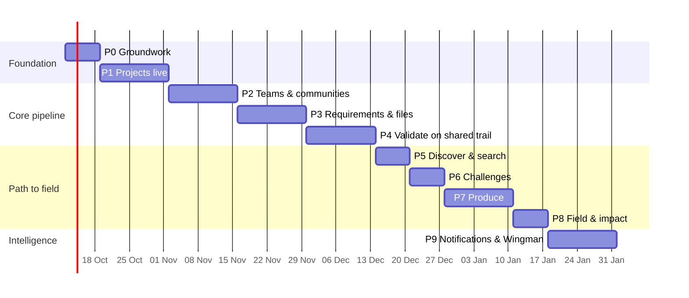

# Idea Forge — Implementation Plan

| | |
| --- | --- |
| Status | Draft v0.1 |
| Date | 9 Oct 2026 |
| Baseline | `main` at `78a46eb` |
| Related | [PRD](01-product-requirements.md) · [TRD](02-technical-requirements.md) · [App flow](03-app-flow.md) · [Design brief](04-design-brief.md) · [Backend schema](05-backend-schema.md) |

## 1. Approach

Ship in vertical slices, the way the repo already works: each slice moves one surface from mock to Lakebase end-to-end (migration → store → route → client → tests → concept label removed). Every slice is independently deployable and leaves `main` green. Durations assume a team of 2 full-stack engineers and part-time design; adjust to staffing.



Total ≈ 16 weeks to the full pipeline; the product is usable for real work after **P4** (≈ 9 weeks).

## 2. Phases

### Phase 0 — Groundwork (1 week)

Goal: the repo is ready for persistent features.

| Task | Files |
| --- | --- |
| Add these planning docs; link them from the README. | `docs/`, `README.md` |
| Reconcile README with the deploy workflow (it already triggers on push to `main`). | `README.md` |
| Add `pg` as an explicit dependency (server tests import it). | `package.json` |
| Provision Lakebase (dev and prod branches); uncomment the `postgres` resource and variables; set `LAKEBASE_ENDPOINT` in `app.yaml`. Deploy once so the service principal owns the schema. | `databricks.yml`, `app.yaml` |
| Migration runner: `server/db/migrate.ts` applies `server/migrations/NNN_*.sql` under `pg_advisory_lock`, tracked in `foundry.schema_migrations`. Port `CadEventStore` DDL as `001_cad_events.sql` (idempotent for existing tables). | `server/db/`, `server/migrations/`, `server/cad-events.ts` |
| Identity middleware: `req.actor`; upsert `foundry.people` on each request (throttled). `/api/me` returns `name`, `org`, `isAdmin`. | `server/identity.ts`, `server/me-route.ts`, `002_people.sql` |
| `GET /api/health`. Structured logging helper. | `server/health.ts`, `server/log.ts` |
| Add `test:unit` for server pure logic; keep `test:server` for Postgres. | `package.json`, `.github/workflows/ci.yml` |

**Exit criteria:** deploy to dev with Lakebase on; `/api/health` green; `foundry.schema_migrations` shows 001–002; CI green.

### Phase 1 — Projects live (2 weeks)

Goal: projects are real, shared and linkable. PRD PR-1, PR-2, PR-4, PR-7, SH-7, MW-1.

| Task | Files |
| --- | --- |
| Migration `003_projects.sql`: `projects`, `project_stage_events` (+ triggers), owner row in `project_members` (table created here, used fully in P2). | `server/migrations/` |
| `ProjectStore`: list (paged, filters), get, create (project + creation stage event + owner member in one transaction), patch (version check), moveStage (advisory lock, entry-criteria hook returning missing items). | `server/projects/store.ts` |
| Routes: `GET/POST /api/projects`, `GET/PATCH /api/projects/:id`, `POST /api/projects/:id/stage`. Parse functions with limits; 400/401/403/409. | `server/projects/routes.ts` |
| Client API layer and data hooks. Decide hand-rolled vs TanStack Query (bundle budget in TRD T-CL-3). | `client/src/lib/api.ts`, `client/src/lib/hooks.ts` |
| Routing: replace `View` state with URL routes behind the existing `navigate()`; back button = history. | `client/src/components/App.tsx`, `client/src/lib/router.ts` |
| Move mock arrays to `client/src/lib/concept.ts`; `data.ts` keeps types and `STAGES`. | `client/src/lib/` |
| Board, MyWork, StageView and IdeaModal read/write through the API. Project workspace route `/projects/:id` (Overview tab). Stage-move control with checklist. | components |
| Seed script for dev: the five concept projects. | `server/db/seed-dev.ts` |
| Tests: store against Postgres (create, list, move, concurrency, append-only), route error paths, router unit tests. | `server/projects/*.test.ts` |

**Exit criteria:** two users in dev each create a project and see each other's; reload keeps the current view; stage moves show in history with actor; My Work matches by person id, not display name.

### Phase 2 — Teams and communities (2 weeks)

PRD CM-1–CM-5, PR-3 (Team tab), MW-2.

| Task | Files |
| --- | --- |
| Migration `004_teams_communities.sql`: `communities`, `community_members`, finish `project_members`, `membership_events`; seed the ten communities. | migrations |
| Stores and routes for communities, membership, project members (invite, accept, decline, volunteer, remove). | `server/communities/`, `server/members/` |
| Directory lookup for person picker (SCIM via service principal; fallback to people already seen). | `server/directory.ts` |
| `CommunityProjects.tsx` moves from `localStorage` to the API; community-sponsored projects are ordinary `projects` with `community_id`. Remove `idea-forge-shared-projects-v1` usage. | components |
| Permission module implementing [App flow §6](03-app-flow.md#6-permissions-matrix) with exhaustive unit tests. | `server/permissions.ts` |

**Exit criteria:** owner invites a real user, who accepts from My Work; open roles show as "community help wanted"; non-owners cannot remove members (403).

### Phase 3 — Requirements and files (2 weeks)

PRD PR-5, PR-6, CAD-8.

| Task | Files |
| --- | --- |
| Migration `005_requirements.sql`: `requirements`, `requirement_events`; ref allocation under project lock. | migrations |
| Requirements store/routes with the state machine in [App flow §4.3](03-app-flow.md#43-requirements-define); reviewer-only accept/reject/retire. | `server/requirements/` |
| Requirements tab UI (table, status chips, history drawer). Define fields (affected users, done criteria, baseline measures). | components |
| Unity Catalog Volume resource; migration `006_files.sql`; upload (stream, size/type check, SHA-256), download with auth check; revisions. | `databricks.yml`, `server/files/` |
| Files tab UI. | components |

**Exit criteria:** reviewer accepts REQ-001 and REQ-002; editing an accepted requirement returns it to Proposed with a new revision; a 50 MB STEP uploads and downloads with matching hash.

### Phase 4 — Validate on the shared trail (2 weeks)

PRD CAD-6, CAD-7, CAD-9. This is the milestone where Idea Forge supports real qualification work.

| Task | Files |
| --- | --- |
| Stage pages scoped to a project: `/projects/:id/stage/design|validate`. CAD workspace in controlled mode with `RemoteSessionStore`, `project = projects.id`, `model = file:<id>@<rev>`, `requirements = accepted requirements`. | `StageView.tsx`, `client/src/cad/store.ts` |
| Server: validate the project exists and that the actor may review (owner/engineer/reviewer) before `cad_events` insert; requirement ref must be an accepted requirement of the project for `link`. | `server/cad-routes.ts` |
| Migration `007_traceability_view.sql`; `GET /api/projects/:id/traceability`. | migrations, `server/traceability.ts` |
| Traceability matrix UI with gap highlighting; CSV export; PDF export of trail + matrix for a qualification package. | components |
| Validate → Produce approval: decision item for the reviewer; entry criteria enforced. | `server/projects/` |
| Playwright smoke + axe on start project → accept requirement → validate feature → approve. | `e2e/` |

**Exit criteria:** every review is attributed to a real user; the matrix shows no gaps before Produce is allowed; export reproduces the trail exactly.

### Phase 5 — Discover and search (1 week)

PRD SH-5, SH-6, CM-6, CM-7. `GET /api/search` (projects tsvector, people, capabilities, challenges); results page; filters; "similar projects" on Discover; Discussion tab (`008_messages.sql`).

### Phase 6 — Challenges (1 week)

PRD CH-1–CH-3. `009_challenges.sql`; sponsor posting (admin or sponsor group); submit a project; Home's Featured challenges reads live data.

### Phase 7 — Produce (2 weeks)

PRD PD-1–PD-3. `010_produce.sql`; capability directory with process/material filters; quote request/response flow; one accepted quote gates Field; capacity signal notification.

### Phase 8 — Field and impact (1 week)

PRD FD-1–FD-3. `011_field.sql`; fielding and impact entry against Define baselines; featured flag; Gallery reads featured/fielded projects; Milestones tab (`012_milestones.sql`).

### Phase 9 — Notifications and Wingman (2 weeks)

PRD NT-1, NT-2, WM-2. `013_notifications.sql`; notifications written in the same transactions as their events; bell reads live data with counts. Wingman calls a Databricks Model Serving endpoint with project context (project, requirements, trail summary, quotes) and returns cited answers; keep the five personas as prompt framings. Add the serving endpoint as an app resource.

## 3. Cross-cutting work (every phase)

- **Definition of done:** migration + store + routes + UI + tests; `npm run typecheck`, `build`, `test:cad`, `test:server` green; concept label removed from the wired surface; README "What is in this slice" updated.
- **Security review** of new routes against the permission matrix before merge.
- **Accessibility check** (keyboard pass + axe) on changed screens.
- **No fabricated data** in live surfaces; mock stays only behind concept labels.
- **Copy** follows [Design brief §6](04-design-brief.md#6-voice-and-copy).

## 4. Proposed server layout

```
server/
  server.ts                 # createApp, plugins, register modules
  identity.ts               # middleware → req.actor, people upsert
  permissions.ts            # role rules (pure, unit-tested)
  log.ts  health.ts
  db/
    migrate.ts  seed-dev.ts
  migrations/
    001_cad_events.sql  002_people.sql  003_projects.sql  …
  cad-events.ts  cad-routes.ts  me-route.ts   # existing
  projects/ communities/ members/ requirements/ files/
  challenges/ produce/ field/ notifications/ search/ wingman/
    store.ts  routes.ts  parse.ts  *.test.ts
```

Each module keeps the existing structural `RouteHost` / `Db` interfaces so tests run without Express or AppKit.

## 5. Risks and dependencies

| Item | Needed by | Owner | Notes |
| --- | --- | --- | --- |
| Lakebase dev/prod branches | P0 | Platform | Blocks everything persistent. |
| `DATABRICKS_TOKEN` (or OIDC federation) on the repo | P0 | Platform | Deploy workflow fails fast without it. |
| Directory (SCIM) read for service principal | P2 | Platform | Fallback exists. |
| UC Volume for files | P3 | Platform | |
| Decision on who accepts requirements (PRD open question 1) | P3 | Product + AFLCMC | Default: project's Qualification Reviewer. |
| CUI decision and markings (PRD open question 3) | Before wide release | Security | |
| Model Serving endpoint | P9 | Platform | Optional; Wingman stays local until then. |

## 6. Release plan

1. **Dev** — every merge to `main` deploys to dev.
2. **Pilot (after P4)** — C-17 community with 20–30 users; feedback loop weekly; track PRD metrics from day one.
3. **Broader release (after P8)** — open to all communities; Army and Navy views enabled.
4. Promote to prod via a tagged release and a manual approval step in the deploy workflow (add a `production` GitHub environment).

## 7. First week checklist

- [ ] Merge these docs.
- [ ] Provision Lakebase dev branch; uncomment resources; deploy.
- [ ] Add `pg` dependency; migration runner with `001_cad_events.sql`, `002_people.sql`.
- [ ] Identity middleware + `/api/me` with name and org.
- [ ] `/api/health`.
- [ ] Fix README deploy wording.
- [ ] Open issues for Phases 1–4 from this plan.
