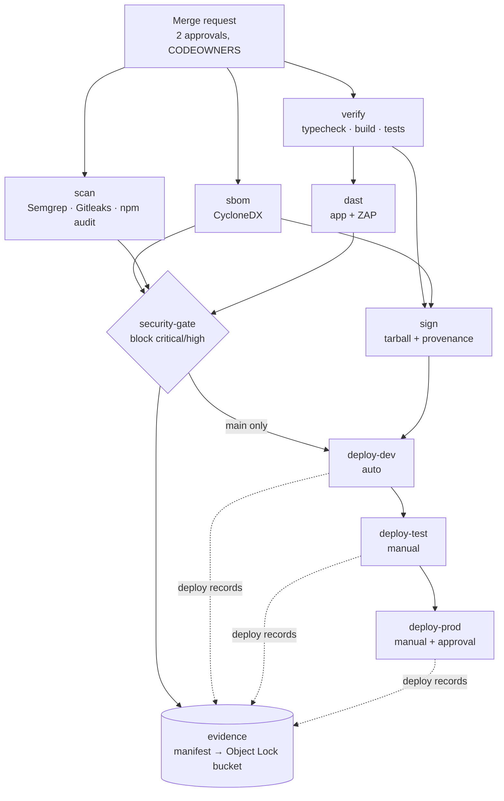

# Idea Forge — GitLab pipeline for IL5 with NIST 800-53 evidence

| | |
| --- | --- |
| Status | Draft v0.1 — not yet run on a GitLab instance |
| Date | 10 Oct 2026 |
| Files | [`.gitlab-ci.yml`](../.gitlab-ci.yml) · [`ci/`](../ci) · [`security/risk-acceptances.json`](../security/risk-acceptances.json) |

The pipeline builds, tests, scans, signs and deploys Idea Forge to Databricks, and every stage leaves evidence behind. The evidence job hashes it, maps it to NIST SP 800-53 Rev. 5 controls, and copies it to write-once storage, so an assessor can trace any control to a file, a commit and a pipeline run.

## 1. Flow



| Pipeline | Runs | Blocks on |
| --- | --- | --- |
| Merge request | verify, sbom, scans, DAST (passive), gate, evidence | Critical and high findings, failed tests |
| `main` | All of the above, then sign and deploy dev → test (manual) → prod (manual, approved) | Same |
| Nightly schedule | Scans, DAST with active scan, gate in report-only mode, evidence | Nothing; findings go to `poam-candidates.json` |

## 2. What IL5 changes

- **GitLab and runners inside the boundary.** Self-managed GitLab (or a GitLab offering authorized at IL5) with runners on the IL5 network. Runners must not pull from public registries or reach the public internet.
- **Images from Iron Bank or a mirror.** Every image is a variable at the top of `.gitlab-ci.yml`. Mirror each, scan it, and pin it by digest.
- **No public Sigstore.** Signing uses a cosign key pair, not keyless signing, because Fulcio and Rekor are not reachable. Store the private key in a CI variable (or a KMS reference `cosign` supports) and commit the public key as `ci/cosign.pub`.
- **Air-gapped rules.** Semgrep pulls rule packs from its registry by default. On an air-gapped runner, vendor the rules into `ci/semgrep/` and set `SEMGREP_RULES` to that path. npm needs an internal registry mirror for `npm ci` and `npm audit`.
- **Databricks authorization.** Confirm the target Databricks deployment and workspace are authorized for IL5 before this pipeline points at them. The pipeline cannot raise that ceiling. GovCloud workspace URLs differ from commercial ones, so set `DATABRICKS_HOST` per environment rather than reusing `databricks.yml`'s host.

## 3. One-time setup

1. **Toolbox image.** Build [`ci/deploy-toolbox.Dockerfile`](../ci/deploy-toolbox.Dockerfile) on an Iron Bank base, scan it, push it to the project registry, and set `TOOLBOX_IMAGE`. It carries the Databricks CLI, cosign, AWS CLI, Node, git and jq.
2. **Signing key.** `cosign generate-key-pair`. Put `cosign.key` in `COSIGN_PRIVATE_KEY` (masked, protected) and its password in `COSIGN_PASSWORD`. Commit `cosign.pub` as `ci/cosign.pub`.
3. **Databricks service principals.** One per environment (dev, test, prod), each with only the rights to deploy the `idea-forge` app in its workspace.
4. **Workload identity federation.** For each service principal, add a federation policy that trusts your GitLab issuer URL, audience = your Databricks account ID, and a subject that only matches this project's protected `main` branch, e.g. `project_path:<group>/idea-forge:ref_type:branch:ref:main`. The jobs request a GitLab ID token with that audience and the CLI exchanges it (`DATABRICKS_AUTH_TYPE=env-oidc`), so no Databricks token is stored anywhere.
5. **Protected environments.** Create `dev`, `test` and `production` environments. Protect `test` and `production`, require approval for `production` from someone other than the person who merged (AC-5), and scope each environment's variables to it.
6. **Evidence bucket.** An S3 bucket in GovCloud with Object Lock in compliance mode and a default retention that meets your records schedule. Give the runner role write-only access. Set `EVIDENCE_BUCKET`.
7. **Repository rules.** Protect `main`: no direct pushes, merge requests only, 2 approvals, CODEOWNERS for `ci/`, `.gitlab-ci.yml` and `security/`, signed commits, pipelines must succeed.
8. **Schedule.** A nightly pipeline schedule on `main`.

### CI/CD variables

| Variable | Scope | Notes |
| --- | --- | --- |
| `DATABRICKS_ACCOUNT_ID` | All | Audience for the GitLab ID token |
| `DATABRICKS_HOST` | Per environment | Workspace URL |
| `DATABRICKS_CLIENT_ID` | Per environment | Service principal application ID |
| `COSIGN_PRIVATE_KEY`, `COSIGN_PASSWORD` | Protected, masked | Signing |
| `EVIDENCE_BUCKET` | Protected | Object Lock bucket name |
| `NODE_IMAGE`, `POSTGRES_IMAGE`, `SYFT_IMAGE`, `GITLEAKS_IMAGE`, `SEMGREP_IMAGE`, `ZAP_IMAGE`, `TOOLBOX_IMAGE` | All | Mirrored, digest-pinned images |
| `SEMGREP_RULES` | All | Rule packs, or a vendored path when air-gapped |
| `LICENSE_DENYLIST` | Optional | Comma-separated SPDX IDs; defaults to GPL-3.0, AGPL-3.0 and SSPL variants |

## 4. The security gate and risk acceptance

[`ci/security-gate.mjs`](../ci/security-gate.mjs) reads every report, normalizes findings to critical / high / medium / low, and fails the pipeline on anything at or above `GATE_FAIL_ON` (default `high`) that is not accepted. A required report that is missing or unreadable is treated as a critical finding, so the gate fails closed.

To accept a risk, add an entry to [`security/risk-acceptances.json`](../security/risk-acceptances.json) through a merge request approved by the ISSO (CODEOWNERS):

```json
[
  {
    "id": "npm:vite:GHSA-xxxx-xxxx-xxxx",
    "reason": "Dev server only; not shipped to the app runtime",
    "approver": "isso@example.mil",
    "poam": "POAM-0012",
    "expires": "2027-01-31"
  }
]
```

Entries without an approver, a POA&M reference or an expiry are ignored, and expired entries stop counting on their expiry date. A trailing `*` in `id` matches a prefix. The gate prints each finding's `id` so it can be copied here.

Every run writes `gate-decision.json` (what was found, accepted and blocked) and `poam-candidates.json` (every medium-or-higher finding with its status), which feed the POA&M in eMASS.

## 5. Control map

Each evidence file is tagged with these controls in `evidence-manifest.json` by [`ci/evidence-manifest.mjs`](../ci/evidence-manifest.mjs). Pipeline evidence supports these controls; it doesn't satisfy them alone. Most also need policy, procedure and inherited Databricks controls in the SSP.

| Evidence | Produced by | Controls |
| --- | --- | --- |
| Merge request approvals, protected branch settings | GitLab (export via API) | CM-3, CM-5, AC-5 |
| `test-*.log` | verify | SA-11, CM-2 |
| `sbom.cdx.json` | sbom | CM-8, SR-4, SA-8 |
| `semgrep.json` | sast | SA-11(1), RA-5, SI-2 |
| `gitleaks.json` | secrets | IA-5(7), SA-11, RA-5 |
| `npm-audit.json` | dependencies | RA-5, SI-2, SR-3 |
| `zap.json`, `zap.html` | dast | SA-11(8), RA-5, CA-2 |
| `provenance.json`, `*.sig` | sign | SI-7, SR-4, SR-11, CM-14 |
| `gate-decision.json` | security-gate | CM-4, CA-7, SA-11 |
| `poam-candidates.json` | security-gate | CA-5, RA-7, PM-4 |
| `deploy-<env>.json`, `deploy-<env>-identity.json` | deploy | CM-3, CM-5, AC-6, IA-5 |
| `evidence-manifest.json` + Object Lock bucket | evidence | AU-9, AU-11, CA-7 |
| Databricks audit system tables, app review trail (`foundry.cad_events`) | Runtime | AU-2, AU-3, AU-6, AU-12, SI-4 |

The next step after this is exporting the manifest to OSCAL assessment results, so findings and evidence load into eMASS without retyping.

## 6. Before the first run

This pipeline has not been run on GitLab yet. The gate, provenance and manifest scripts were tested locally against sample reports. Expect to adjust these on the first run:

- **DAST startup.** The `dast` job starts the app with `npm run start` and waits for port 8000. Confirm AppKit starts without Databricks credentials outside Databricks, which port it listens on (`DATABRICKS_APP_PORT` is set to 8000), and that it binds to all interfaces so the ZAP service can reach it as `build`. If it doesn't, the job fails and prints the app log.
- **Package mirrors.** `verify`, `dependencies` and `dast` need `npm ci` and `apt-get` to reach internal mirrors.
- **Image entrypoints.** Mirrored images may set entrypoints differently from the public ones; the jobs reset them where needed.
- **Licensing tier.** The pipeline does not depend on GitLab Ultimate. If you have Ultimate, you can also include GitLab's own SAST, secret detection and DAST templates to get the security dashboard and merge request security widgets, and use security policies to enforce the gate centrally. Protected environment approvals need Premium or above.
- **Deploy method.** The deploy jobs mirror the existing GitHub workflow (`workspace import-dir` then `apps deploy`) and upload the exact signed tarball. Databricks Apps builds the Node app from the lockfile on start, so the SBOM and lockfile hash in the provenance are what tie the running app to the scanned code.
